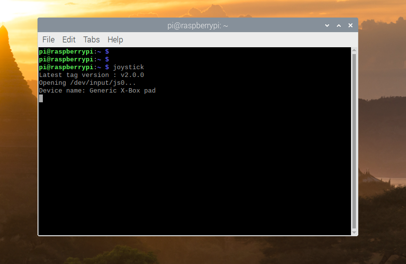

# joystick-res

This is a package related to Raspberry Pi 3 setting method and joystick package installation manual.

The joystick package is [here](https://github.com/jdj2261/joystick-serial.git), so please refer to it.

### Reference materials(address)

- Raspberry Pi OS install  ➡ [reference](https://www.raspberrypi.org/downloads/raspberry-pi-os/)
- Wifi connection ➡ [reference](https://www.withover.com/2018/08/wifi.html)
- Hangul Install ➡ [reference1](https://sm987.blogspot.com/2018/12/fcitx-im-config.html), [reference2](https://alwt.tistory.com/78)
- Joystick ➡ [reference](https://github.com/jdj2261/joystick-serial.git)
- Serial ➡ [reference](https://luciferd.tistory.com/entry/Raspberry-Uart-사용방법)
- Auto reboot ➡ [reference](https://frogbam07.tistory.com/1)
- Canceling sleep mode ➡ [reference](https://geeksvoyage.com/raspberry%20pi/turn-off-screen-blanking)

### Raspberry Pi 3 Settings

#### Run auto Install script

Created a shell script that automatically does all the installations, including the below.

See [install.sh](https://github.com/jdj2261/joystick-res/blob/master/install.sh) file.

~~~
$ git clone https://github.com/jdj2261/joystick-res.git
$ cd joystick-res
$ ./install.sh
~~~

*If you have run the automatic installation script, you do not need to follow the instructions below.* 

##### 1. wifi connection

go to Raspberry Pi Configuration

If it is not GB, the Wi-Fi connection status at the top will not appear.

> Localisation -> Wifi Country -> GB(Britain)

##### 2. Hangul Install

~~~
$ sudo apt-get install fonts-unfonts-core
$ sudo apt-get install fcitx-hangul
$ sudo vi /etc/default/im-config
IF_CONFIG_DEFAULT_MODE=fcitx (auto -> fcitx change)
$ reboot
~~~

##### 3. Regional Settings and Keyboard

go to Raspberry Pi Configuration

Change to Locale: **Korean** and reboot

Picture of the upper right keyboard Right mouse button

Input method Korean added

##### 4. Serial Activation

1. Enable serial in **raspi-config**

   ~~~
   $ sudo raspi-config
     5 Interfacing Options Choose
     P6 Serial Choose
     YES Choose
   ~~~

2. Disable Bluetooth

   ~~~
   $ sudo vi /boot/config.txt
   dtoverlay=pi3-disable-bt Bottom Add
   $ sudo systemctl disable hciuart
   ~~~

3. Disable Console

   ~~~
   $ sudo vi /boot/cmdline.txt
   console=serial0.115200 Deletion
   ~~~

4. Result Check

   ~~~
   $ ll /dev/serial0
   make sure /dev/serial0 -> ttyAMA0
   ~~~

### Result

<left> When the installation is complete, the reboot starts. After rebooting, the following screen appears.</left>

### Test

<left>To run without rebooting, open a terminal and enter the joystick command</left>

